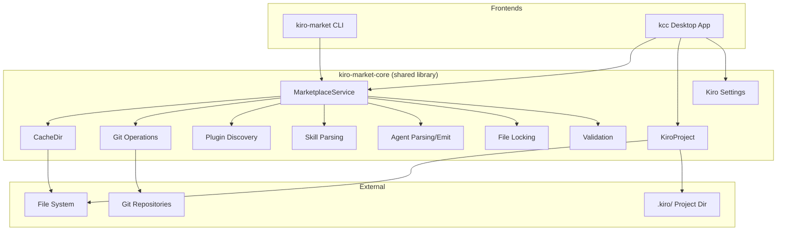

# Architecture

## System Overview

Kiro Control Center follows a layered architecture with a shared core library consumed by two frontends (CLI and desktop GUI).



## Architectural Patterns

### Shared Core, Thin Frontends

The `kiro-market-core` crate contains all business logic. Both the CLI (`kiro-market`) and the desktop app (`kiro-control-center`) are thin presentation layers that call into the core. This ensures consistent behavior regardless of interface.

### Service Layer Pattern

`MarketplaceService` is the primary orchestrator. It coordinates:
- Marketplace registration (clone/link/copy)
- Plugin discovery and registry management
- Skill/agent installation into projects

The service accepts a `GitBackend` trait for testability — production uses real git, tests inject mocks.

### File-Based State with Locking

All persistent state is stored as JSON files on disk:
- `~/.cache/kiro-market/` — marketplace clones, plugin registries
- `.kiro/installed-skills.json` — per-project skill tracking
- `.kiro/installed-agents.json` — per-project agent tracking

Concurrent access is serialized via `fs4` file locks (`file_lock.rs`).

### RAII Cleanup Guards

`DirCleanupGuard` ensures temporary/staging directories are removed on failure. The guard can be `defuse()`d on success or `retarget()`ed to a different path. This prevents orphaned temp dirs from interrupted operations.

### Dual Git Backend

Git operations use `gix` (pure Rust) as the primary backend with a CLI fallback (`git` subprocess). If `gix` fails (e.g., auth issues), the system tries the CLI backend. Both errors are combined for diagnostics.

### Typed IPC (Tauri + Specta)

The desktop app uses `tauri-specta` to generate TypeScript bindings from Rust command signatures. This provides compile-time type safety across the IPC boundary. Bindings are regenerated via a test:
```
cargo test -p kiro-control-center --lib -- --ignored generate_types
```

### Feature Flags

The core library uses Cargo features for optional functionality:
- `cli` — enables `clap` derive on types (used by CLI crate)
- `specta` — enables specta derive for TypeScript binding generation (used by Tauri crate)
- `test-support` — exposes test utilities

## Security Architecture

### Path Traversal Prevention

All user-supplied names and paths are validated through `validation.rs`:
- `validate_name()` — rejects `/`, `\`, `..`, Windows reserved names, control chars
- `validate_relative_path()` — rejects absolute paths, parent traversal, backslashes, NUL bytes
- `RelativePath` newtype — validated at construction, cannot be created with unsafe content

### MCP Agent Gating

Agents with MCP server configurations (which can execute arbitrary processes) require explicit `--accept-mcp` opt-in. Without it, MCP-bearing agents are skipped with a warning.

### TLS Enforcement

HTTP marketplace sources are rejected by default. The `--allow-insecure-http` flag must be explicitly passed. CI asserts that `curl-sys` is built with the `ssl` feature to prevent silent plaintext fallback.

### Symlink/Hardlink Rejection

`copy_dir_recursive` skips symlinks and hardlinks in source trees to prevent escape-to-arbitrary-path attacks during skill installation.

## Error Handling

The crate uses a structured error hierarchy (`error.rs`):
- `Error` — top-level enum with variants for each subsystem
- `MarketplaceError`, `PluginError`, `SkillError`, `AgentError`, `GitError`, `ValidationError`
- `error_full_chain()` / `error_source_chain()` — utilities for formatting nested error chains

The Tauri layer maps core errors to `CommandError` with typed `ErrorType` variants for frontend consumption.

## Platform Handling

`platform.rs` abstracts OS-specific behavior:
- **Unix**: symlinks for local marketplace linking
- **Windows**: NTFS junctions (preferred), with recursive copy as fallback
- Detection via `is_local_link()`, creation via `create_local_link()`, removal via `remove_local_link()`
