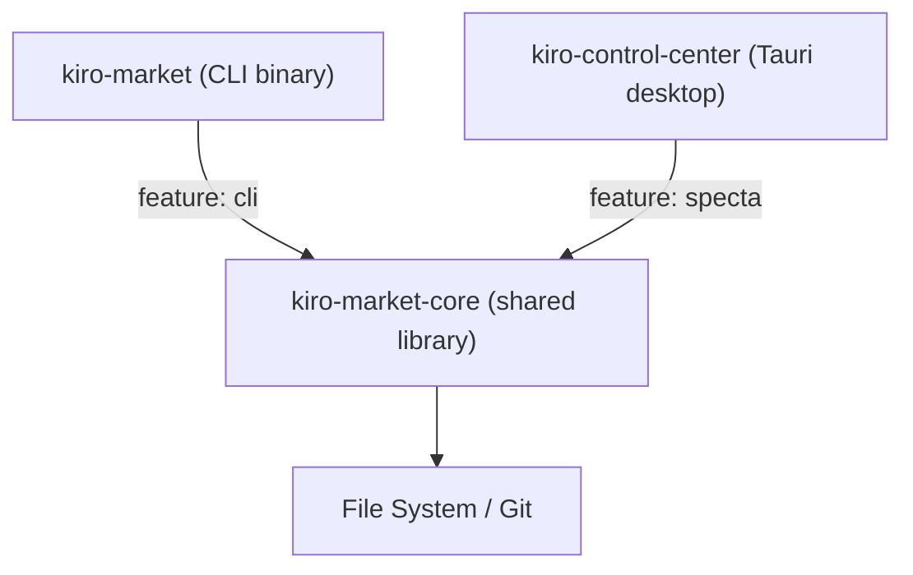
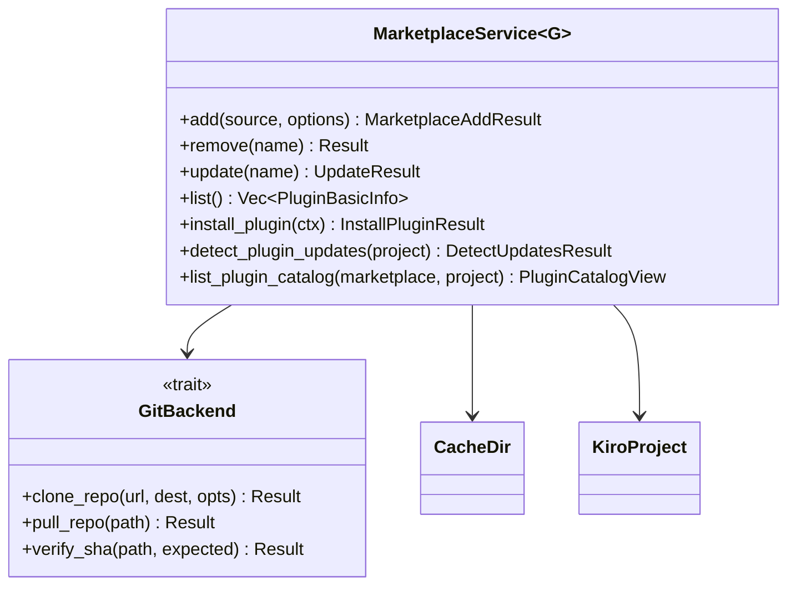
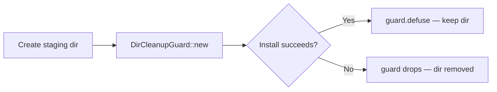
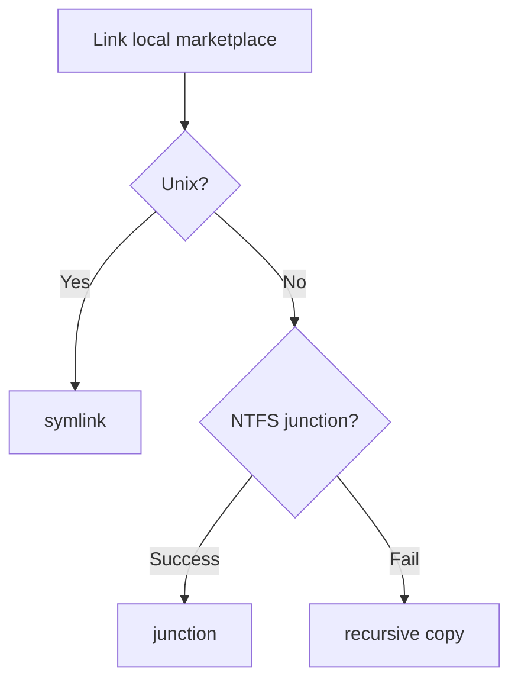

# Architecture

<!-- tags: architecture, patterns, design -->

## Core Pattern: Shared-Core / Thin Frontends

All business logic lives in `kiro-market-core`. The CLI and desktop app are presentation-only wrappers. No business logic belongs in the frontend crates.



## Service Layer

`MarketplaceService` in `service/mod.rs` is the primary orchestrator. It is generic over `GitBackend`, enabling test injection of mock backends.



## IPC Binding Generation

`tauri-specta` generates `src/lib/bindings.ts` from Rust types. Never edit this file manually. Regenerate after changing any Tauri command:

```
cargo test -p kiro-control-center --lib -- --ignored generate_types
```

In debug builds, `run()` in `lib.rs` auto-exports bindings on startup. The `bindings_export_plugin_catalog_view` test asserts required types are present in the committed file.

## File-Based State

All persistence is JSON on disk. No database. Concurrent access serialized via `fs4` file locks (one `.lock` file per tracking file).

| Path | Purpose |
|---|---|
| `~/.cache/kiro-market/` | Marketplace clones, plugin registries |
| `.kiro/installed-skills.json` | Installed skill tracking |
| `.kiro/installed-agents.json` | Installed agent tracking |
| `.kiro/installed-steering.json` | Installed steering file tracking |
| `.kiro/settings.json` | Project-level Kiro settings |

## RAII Staging Pattern

Installs use a staging directory. `DirCleanupGuard` removes it on drop (failure path). Call `.defuse()` on success.



## Feature Flags

| Flag | Activating crate | Effect |
|---|---|---|
| `cli` | `kiro-market` | Enables `clap` derives on core types |
| `specta` | `kiro-control-center` | Enables `specta::Type` derives for TS binding generation |
| `test-support` | dev-deps (self-cycle) | Exposes `service::test_support` with mock backends |

The self-cycle dev-dep (`kiro-market-core` depends on itself with `features = ["test-support"]`) lets integration tests in `tests/` access test utilities without `cfg(test)`.

## Platform Abstraction



`MarketplaceStorage` enum tracks which method was used. `copy_dir_recursive` skips symlinks and hardlinks in source trees.

## Security Model

Path safety is enforced at type construction, not at call sites:

- `validate_name()` — rejects traversal, NUL bytes, Windows reserved names, control chars
- `validate_relative_path()` — rejects absolute paths, `..` components, backslashes
- `RelativePath` newtype — only constructible via `validate_relative_path()`
- MCP agents require explicit `--accept-mcp` opt-in
- `http://` sources rejected unless `--allow-insecure-http` is passed
- `unsafe_code = "forbid"` at workspace level

## TLS Activation Pattern

`kiro-market-core` takes `curl = { workspace = true }` as a direct dependency solely to activate the `ssl` feature on `curl-sys` (pulled transitively by `gix-transport`). Without this activator, HTTPS clones silently fall back to plaintext on static-libcurl builds. The `assert-curl-tls` CI job verifies this invariant.

## xtask Hooks

| Hook | Trigger | Action |
|---|---|---|
| `hook-block-cargo-lock` | PreToolUse Write/Edit | Blocks direct Cargo.lock edits; use `cargo update -p <crate>` instead. Override: `KIRO_ALLOW_LOCKFILE_EDIT=1` |
| `hook-post-edit` | PostToolUse Write/Edit | Runs `rustfmt` then `clippy` on the edited file's package |

## plan-lint Gates

`cargo xtask plan-lint` enforces:
- `no_panic` — no `panic!`, `todo!`, `unimplemented!` in production code
- `no_unwrap` — no `.unwrap()` or `.expect()` in production code
- `non_exhaustive` — public error enums in `kiro-market-core` must have `#[non_exhaustive]`
- `no_frontend_deps` — `kiro-market-core` must not import `tauri` or `tokio`
- `ffi_enum_tag` — public enums with payload exposed via `specta` must have a serde tag
