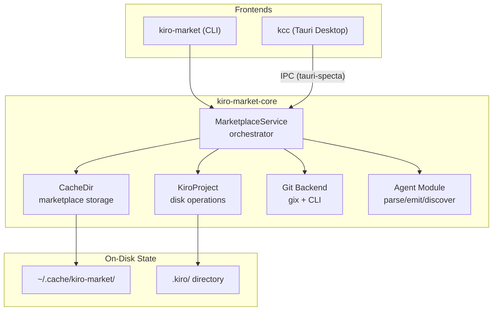
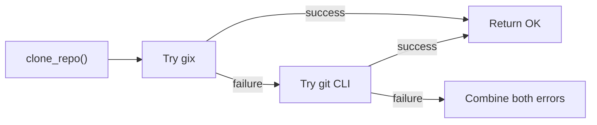
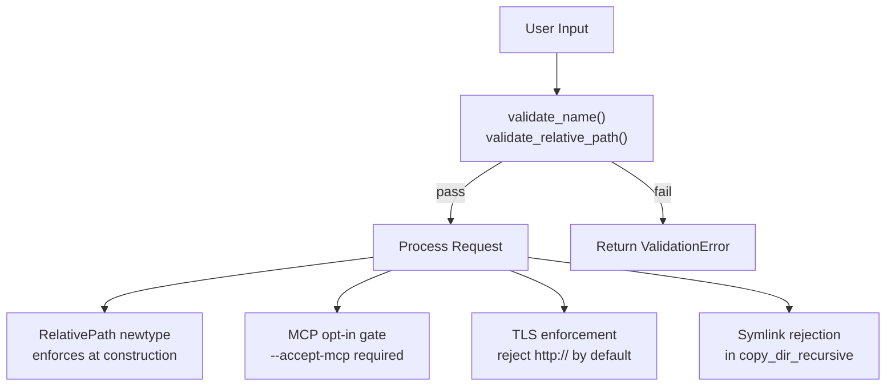

# Architecture

## Design Philosophy

**Shared core, thin frontends.** All business logic lives in `kiro-market-core`. The CLI (`kiro-market`) and desktop app (`kiro-control-center`) are presentation-only wrappers that delegate to the core library. This ensures behavior parity between interfaces and keeps the test surface concentrated.

## System Layers

## Key Architectural Decisions

### 1. Generic Git Backend

`MarketplaceService` is generic over a `GitBackend` trait. Production uses `GixCliBackend` (tries gix first, falls back to git CLI). Tests inject mock backends for deterministic behavior without network access.

### 2. File-Based State (No Database)

All persistence is JSON on disk:
- `~/.cache/kiro-market/` — marketplace clones, plugin registries
- `.kiro/installed-skills.json` — installed skill tracking
- `.kiro/installed-agents.json` — installed agent tracking
- `.kiro/settings.json` — project-level Kiro settings

Concurrent access is serialized via `fs4` file locks.

### 3. RAII Cleanup Guards

`DirCleanupGuard` auto-removes staging directories on failure (Drop). Call `.defuse()` on success to keep the directory. This prevents orphaned temp dirs from interrupted operations.

### 4. Typed IPC via tauri-specta

Tauri commands are defined in Rust with `specta::Type` derives. The `generate_types` test produces `bindings.ts` with full TypeScript types for all commands and their return types. The frontend never uses untyped `invoke()`.

### 5. Dual Git Backend Strategy

`gix` provides pure-Rust git without subprocess overhead. The CLI fallback handles edge cases (auth helpers, unusual SSH configs). Both errors are combined for diagnostics.

### 6. Platform Abstraction

Local marketplaces use OS-native linking:
- **Unix**: symlinks
- **Windows**: NTFS junctions (preferred), recursive copy (fallback)

`MarketplaceStorage` enum tracks which method was used so the UI can warn about copy-mode limitations.

## Security Architecture

**Invariants:**
1. All user-supplied names pass `validate_name()` (rejects traversal, reserved names, control chars)
2. All paths use `RelativePath` newtype (rejects absolute paths, `..`, backslash)
3. MCP agents require explicit `--accept-mcp` opt-in
4. `http://` sources rejected unless `--allow-insecure-http` passed
5. `copy_dir_recursive` skips symlinks and hardlinks in source trees
6. Workspace-level `unsafe_code = "forbid"`

## Error Handling Strategy

Errors are organized into domain-specific enums (`MarketplaceError`, `PluginError`, `SkillError`, `AgentError`, `GitError`) unified by a top-level `Error` enum with `From` conversions. Each variant carries enough context for actionable error messages (paths, names, source chains).

The Tauri layer wraps core errors into `CommandError` with an `ErrorType` discriminant for frontend-friendly categorization.
