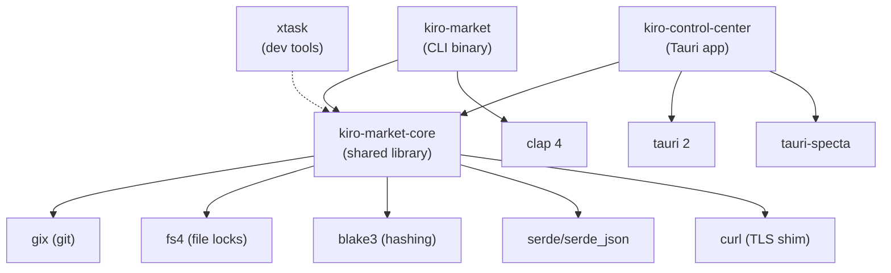

# Codebase Information

## Project Identity

- **Name**: Kiro Control Center (kiro-control-center)
- **Repository**: https://github.com/dwalleck/kiro-marketplace-cli
- **License**: MIT
- **Rust Edition**: 2024
- **MSRV**: 1.85.0
- **Description**: Desktop app and CLI for browsing, installing, and managing Claude Code marketplace skills and agents in Kiro projects.

## Technology Stack

| Layer | Technology | Version |
|-------|-----------|---------|
| Core library | Rust | 1.85.0+ |
| CLI | Rust + Clap 4 | derive-based |
| Desktop backend | Tauri 2 | 2.x |
| Desktop frontend | Svelte 5 + SvelteKit | 5.x |
| Styling | Tailwind CSS 4 | 4.2.x |
| TypeScript bindings | tauri-specta | 2.0.0-rc.24 |
| Build tooling | Vite 6 | 6.x |
| E2E testing | Playwright | 1.59+ |
| Git operations | gix (primary) + git CLI (fallback) | 0.81 |
| Hashing | BLAKE3 | 1.5 |
| File locking | fs4 | 0.13 |
| Platform linking | junction (Windows) | 1.x |

## Languages

| Language | Usage | Location |
|----------|-------|----------|
| Rust | Core logic, CLI, Tauri backend | `crates/` |
| TypeScript | Frontend UI, bindings | `crates/kiro-control-center/src/` |
| Svelte | UI components | `src/lib/components/` |
| Python | CI review comment posting | `.github/scripts/` |
| YAML | CI workflows, config | `.github/workflows/` |

## Workspace Structure

```
kiro-control-center/
├── crates/
│   ├── kiro-market-core/       # Shared library (all business logic)
│   ├── kiro-market/            # CLI binary (thin clap wrapper)
│   └── kiro-control-center/    # Desktop app (Tauri 2 + Svelte 5)
│       ├── src-tauri/          #   Rust backend
│       └── src/                #   Svelte frontend
├── xtask/                      # Dev tooling (hooks, formatting)
├── .github/                    # CI workflows and scripts
├── .claude/                    # Claude Code hooks config
└── .kiro/                      # Kiro steering files
```

## Crate Dependency Graph



## Feature Flags (kiro-market-core)

| Feature | Purpose | Consumer |
|---------|---------|----------|
| `cli` | Enables clap derives on types | kiro-market (CLI) |
| `specta` | Enables TypeScript binding derives | kiro-control-center (Tauri) |
| `test-support` | Exposes test utilities and mock backends | Integration tests |

## Key Metrics

- **Workspace members**: 4 crates
- **Frontend components**: 10 Svelte components
- **Tauri IPC commands**: 17 registered commands
- **CI jobs**: 10+ (commitlint, format, lint, test, frontend, build-cli, build-tauri, cargo-deny, assert-curl-tls, coverage)

## Build Outputs

| Crate | Binary | Description |
|-------|--------|-------------|
| kiro-market | `kiro-market` | CLI tool |
| kiro-control-center | `kcc` | Desktop application |
| xtask | `xtask` | Dev tooling (hooks) |
