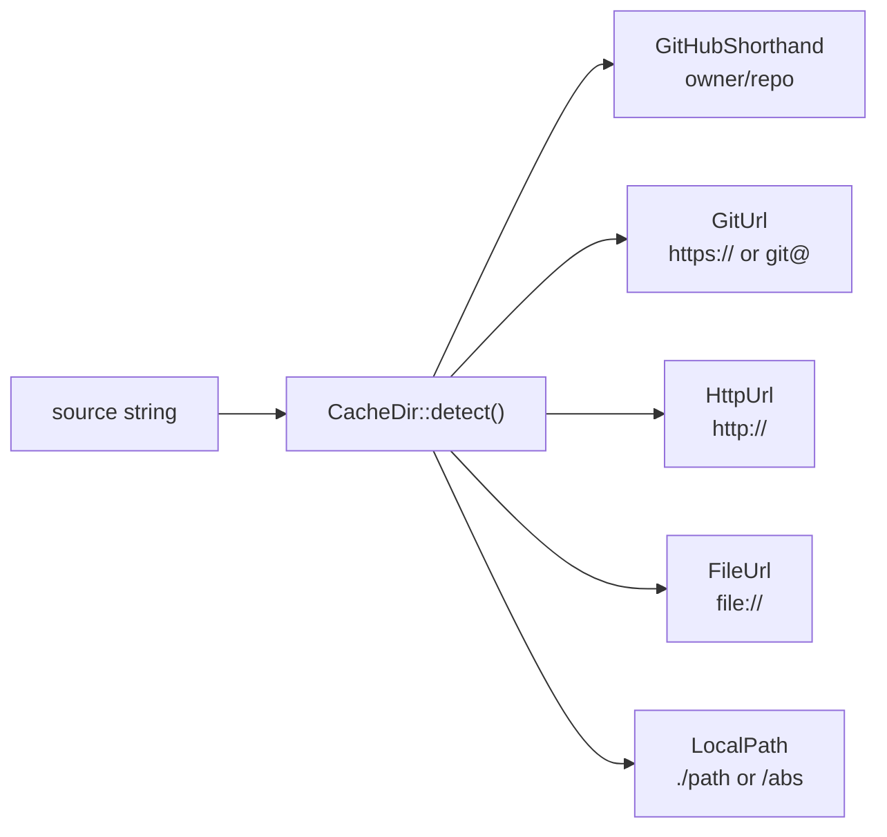
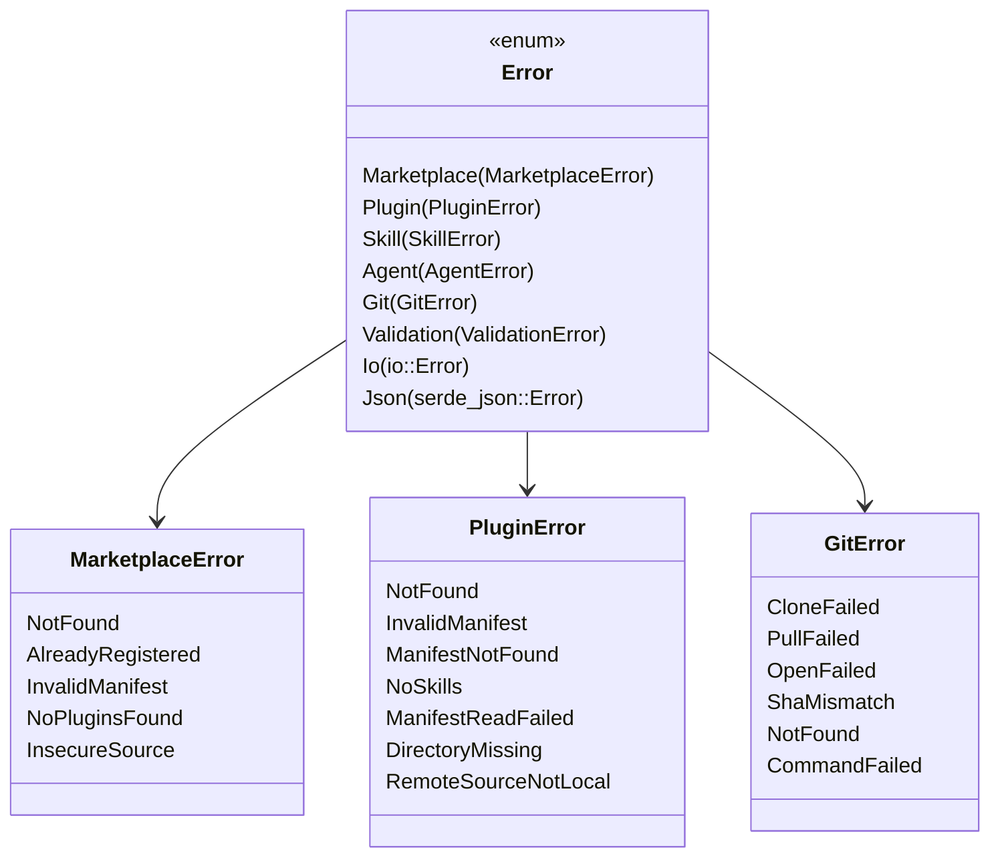

# Data Models

## On-Disk State Files

### ~/.cache/kiro-market/known-marketplaces.json

```json
[
  {
    "name": "dotnet-agent-skills",
    "source": "https://github.com/microsoft/dotnet-agent-skills.git"
  }
]
```

### ~/.cache/kiro-market/registries/{marketplace}.json

Plugin registry persisted after marketplace add/update:

```json
[
  {
    "name": "dotnet",
    "description": "EF Core and .NET skills",
    "path": "./dotnet",
    "source": null
  }
]
```

### .kiro/installed-skills.json

```json
{
  "skills": {
    "efcore": {
      "marketplace": "dotnet-agent-skills",
      "plugin": "dotnet",
      "version": "abc1234",
      "installed_at": "2025-01-15T10:30:00Z",
      "source_hash": "blake3:abcdef...",
      "installed_hash": "blake3:123456..."
    }
  }
}
```

### .kiro/installed-agents.json

```json
{
  "agents": {
    "my-agent": {
      "marketplace": "dotnet-agent-skills",
      "plugin": "dotnet",
      "dialect": "claude",
      "installed_at": "2025-01-15T10:30:00Z",
      "source_hash": "blake3:abcdef...",
      "installed_hash": "blake3:123456...",
      "native_companions": {}
    }
  }
}
```

### .kiro/installed-steering.json

```json
{
  "files": {
    "review-process.md": {
      "marketplace": "dotnet-agent-skills",
      "plugin": "dotnet",
      "installed_at": "2025-01-15T10:30:00Z",
      "source_hash": "blake3:abcdef...",
      "installed_hash": "blake3:123456..."
    }
  }
}
```

---

## Core Domain Types

### MarketplaceSource (enum)

Detected from user input string:



### AgentDefinition

Unified representation after parsing any dialect:

| Field | Type | Description |
|-------|------|-------------|
| `name` | `String` | Agent identifier |
| `description` | `Option<String>` | Human-readable description |
| `model` | `Option<String>` | LLM model preference |
| `dialect` | `AgentDialect` | Source format (Claude, Copilot, Native) |
| `body` | `String` | Prompt/system message content |
| `source_tools` | `Vec<String>` | Original tool names from source |
| `mcp_servers` | `Vec<McpServerConfig>` | MCP server declarations |

### AgentDialect (enum)

- `Claude` — parsed from `.md` with YAML frontmatter
- `Copilot` — parsed from `.agent.md` with YAML frontmatter
- `Native` — parsed from Kiro JSON format

### McpServerConfig

| Field | Type | Description |
|-------|------|-------------|
| `name` | `String` | Server identifier |
| `transport` | `Transport` | `Stdio { command, args, env }` or `Http { url }` |

### SkillFrontmatter

| Field | Type | Description |
|-------|------|-------------|
| `name` | `String` | Skill identifier (validated) |
| `description` | `Option<String>` | Human-readable description |
| `invocable` | `Option<bool>` | Whether skill can be invoked directly |

### PluginManifest (from plugin.json)

| Field | Type | Description |
|-------|------|-------------|
| `name` | `String` | Plugin identifier |
| `description` | `Option<String>` | Description |
| `skills` | `Vec<String>` | Skill scan paths |
| `agents` | `Vec<String>` | Agent scan paths |
| `steering` | `Vec<String>` | Steering file scan paths |
| `format` | `Option<PluginFormat>` | `KiroCli` for native agents |

### InstallMode (enum)

- `Normal` — skip if already installed
- `Force` — overwrite existing installations

### InsecureHttpPolicy (enum)

- `Reject` — refuse `http://` URLs (default)
- `Allow` — permit insecure sources (requires explicit opt-in)

---

## Error Hierarchy



---

## Tauri Frontend Types

The desktop app adds presentation-layer types:

| Type | Purpose |
|------|---------|
| `MarketplaceInfo` | Marketplace with source type and plugin count |
| `PluginInfo` | Plugin with skill count and source type |
| `SourceType` | `github`, `git_url`, `local_path`, `git_subdir` |
| `ProjectInfo` | Active project path and validation status |
| `InstalledSkillInfo` | Installed skill with display metadata |
| `Settings` | App-level settings (scan roots, active project) |
| `DiscoveredProject` | Found project path from scan |
| `CommandError` | Typed error with `ErrorType` discriminant |
