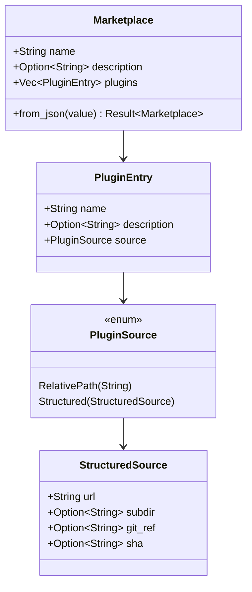
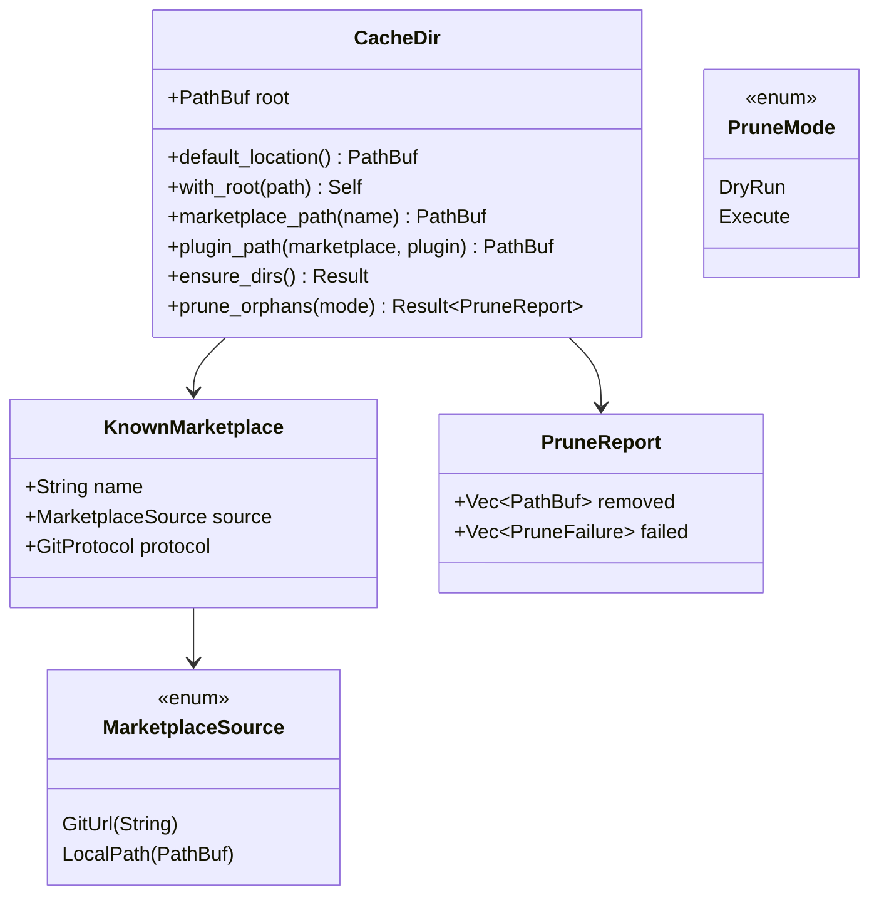
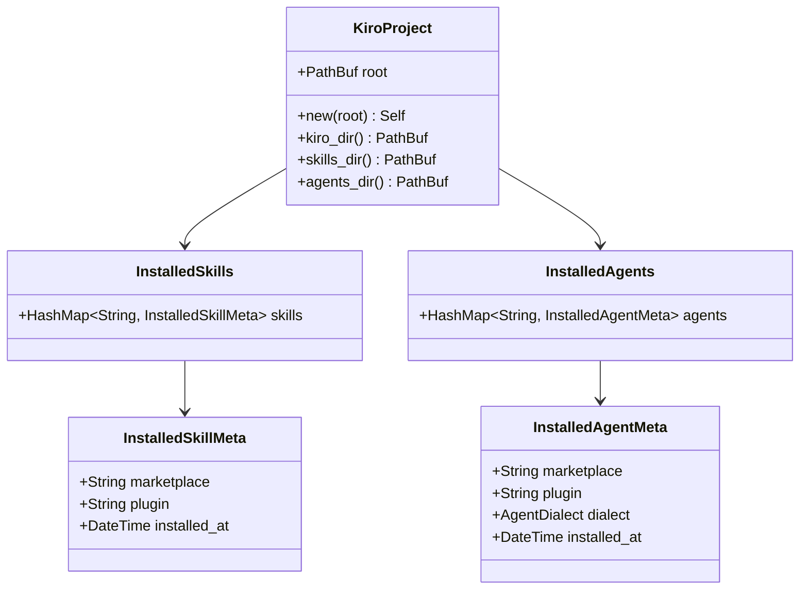
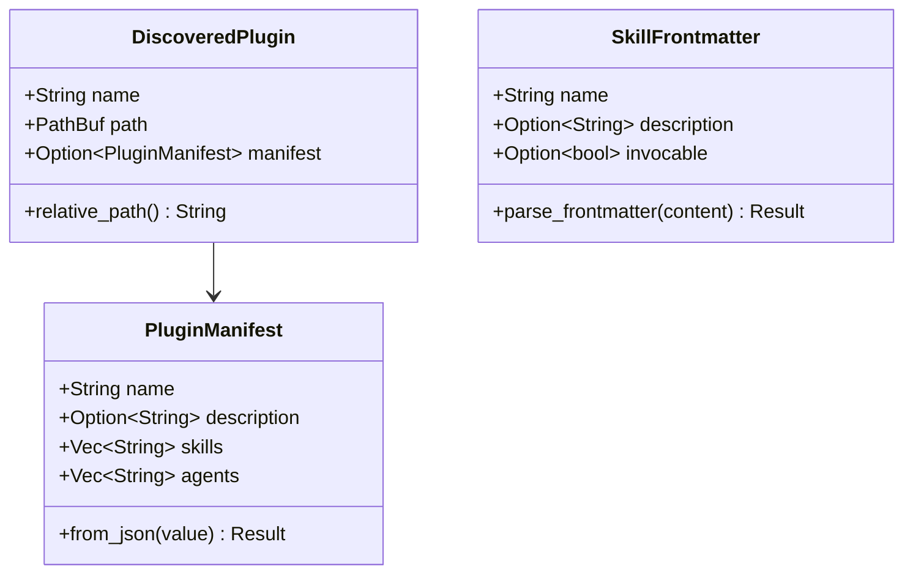
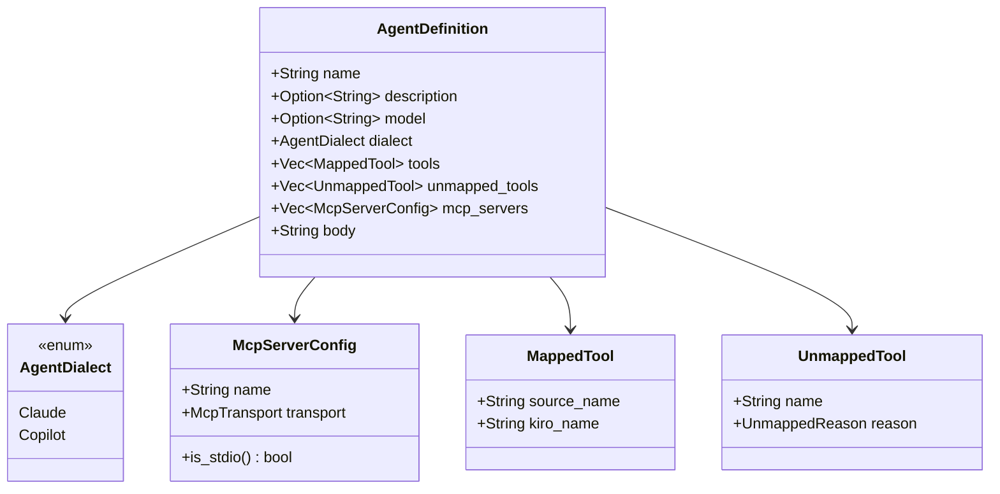
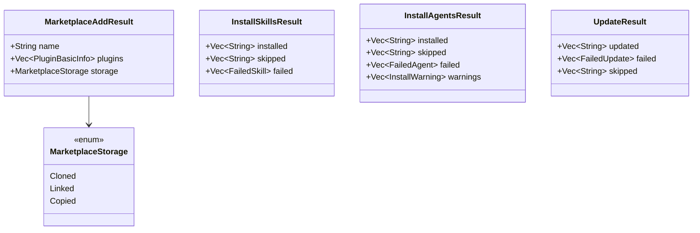
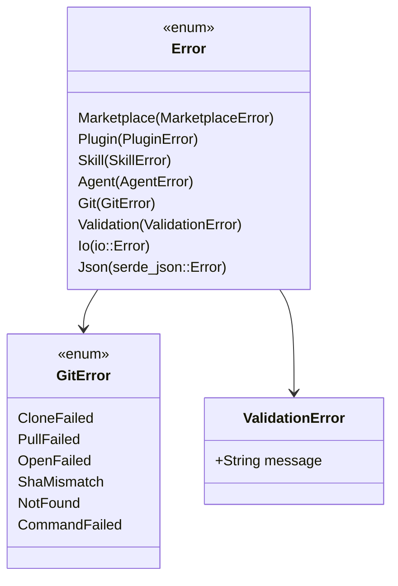
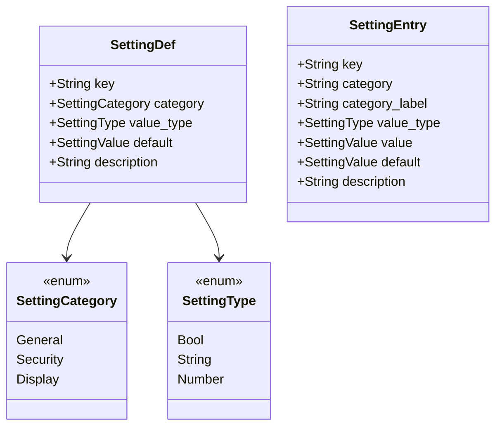

# Data Models

## Core Domain Types

### Marketplace Layer

### Cache Layer

### Project Layer

### Plugin & Skill Layer

### Agent Layer

### Service Result Types

### Error Types

### Settings Types

## Tauri Frontend Types

### TypeScript Interfaces (auto-generated via specta)

Key types exposed to the frontend:

- `MarketplaceInfo` — marketplace name, source type, plugin count
- `PluginInfo` — plugin name, description, source type
- `SkillInfo` — skill name, description, installed status
- `InstalledSkillInfo` — name, marketplace, plugin, version, install date
- `ProjectInfo` — project path, installed skill/agent counts
- `Settings` — scan roots, last project
- `DiscoveredProject` — path, has `.kiro/` directory
- `SettingEntry` — key, category, type, value, default, description
- `CommandError` — error type enum + message string
- `SourceType` — `github` | `git_url` | `local_path` | `git_subdir`
