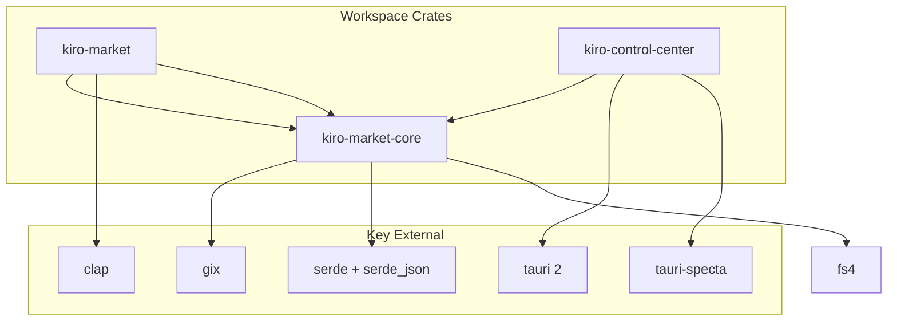

# Dependencies

## Rust Dependencies (Workspace)

### Serialization
| Crate | Version | Purpose |
|-------|---------|---------|
| `serde` | 1 (derive) | Serialization/deserialization framework |
| `serde_json` | 1 | JSON parsing and generation |
| `serde_yaml_ng` | 0.10 | YAML frontmatter parsing (skills, agents) |

### CLI
| Crate | Version | Purpose |
|-------|---------|---------|
| `clap` | 4 (derive) | Command-line argument parsing |
| `colored` | 3 | Terminal color output |
| `anyhow` | 1 | Ergonomic error handling in CLI binary |

### Git
| Crate | Version | Purpose |
|-------|---------|---------|
| `gix` | 0.81 | Pure-Rust git implementation (primary clone/pull backend) |
| `curl` | 0.4 (ssl) | Feature-unification shim ensuring TLS for gix-transport |

### Error Handling
| Crate | Version | Purpose |
|-------|---------|---------|
| `thiserror` | 2 | Derive macro for structured error types |

### Logging
| Crate | Version | Purpose |
|-------|---------|---------|
| `tracing` | 0.1 | Structured logging facade |
| `tracing-subscriber` | 0.3 (env-filter) | Log output formatting and filtering |

### File System
| Crate | Version | Purpose |
|-------|---------|---------|
| `dirs` | 6 | Platform-standard directory paths (cache, config) |
| `fs4` | 0.13 | Cross-platform file locking |
| `junction` | 1 | Windows NTFS junction creation |

### Date/Time
| Crate | Version | Purpose |
|-------|---------|---------|
| `chrono` | 0.4 (serde) | Timestamps for install tracking |

### Testing
| Crate | Version | Purpose |
|-------|---------|---------|
| `rstest` | 0.26 | Parameterized test fixtures |
| `tempfile` | 3 | Temporary directories for test isolation |

## Desktop App Dependencies (Tauri Crate)

| Crate | Version | Purpose |
|-------|---------|---------|
| `tauri` | 2 | Desktop app framework |
| `tauri-plugin-dialog` | 2 | Native file/folder dialogs |
| `tauri-plugin-opener` | 2 | Open URLs/files with system default |
| `tauri-specta` | 2.0.0-rc.24 | TypeScript binding generation from Rust types |
| `specta` | 2.0.0-rc.24 | Type reflection for specta ecosystem |
| `specta-typescript` | 0.0.11 | TypeScript code generation |
| `tokio` | 1 (dev) | Async runtime for tests |

## Frontend Dependencies (npm)

### Production
| Package | Version | Purpose |
|---------|---------|---------|
| `@tauri-apps/api` | ^2 | Tauri IPC from JavaScript |
| `@tauri-apps/plugin-dialog` | ^2.7.0 | Dialog plugin JS bindings |
| `@tauri-apps/plugin-opener` | ^2 | Opener plugin JS bindings |
| `tailwindcss` | ^4.2.2 | Utility-first CSS framework |
| `@tailwindcss/postcss` | ^4.2.2 | PostCSS integration for Tailwind |
| `postcss` | ^8.5.8 | CSS transformation pipeline |

### Development
| Package | Version | Purpose |
|---------|---------|---------|
| `svelte` | ^5.0.0 | UI framework (runes mode) |
| `@sveltejs/kit` | ^2.9.0 | App framework (static adapter for Tauri) |
| `@sveltejs/adapter-static` | ^3.0.6 | Static site generation for Tauri embedding |
| `@sveltejs/vite-plugin-svelte` | ^5.0.0 | Vite integration for Svelte |
| `vite` | ^6.0.3 | Frontend build tool |
| `typescript` | ~5.6.2 | Type checking |
| `svelte-check` | ^4.0.0 | Svelte type checking CLI |
| `@playwright/test` | ^1.59.1 | End-to-end testing |
| `@tauri-apps/cli` | ^2 | Tauri CLI for dev/build |
| `@types/node` | ^25.5.2 | Node.js type definitions |

## Dependency Relationships

## Notable Dependency Decisions

### curl feature-unification shim

The workspace declares `curl = { version = "0.4", features = ["ssl"] }` and `kiro-market-core` takes it as a direct dependency. This is **not** used for HTTP requests directly — it exists solely to ensure `curl-sys` (pulled transitively by `gix-transport`) is built with TLS support. Without this, static libcurl builds on Windows could silently fall back to plaintext HTTP. CI's `assert-curl-tls` job verifies this.

### gix over git2

The project uses `gix` (pure Rust) rather than `git2` (libgit2 bindings). This avoids C compilation dependencies and provides better error messages. A CLI fallback (`git` subprocess) handles cases where gix fails (e.g., certain auth configurations).

### Svelte 5 runes mode

The frontend uses Svelte 5's `$state` and `$derived` runes rather than Svelte 4 stores. State is shared across components via a module-level `$state` object pattern.

### SvelteKit static adapter

Despite using SvelteKit, the app uses `adapter-static` since it's embedded in Tauri (no server-side rendering needed). SvelteKit provides routing and build tooling.
