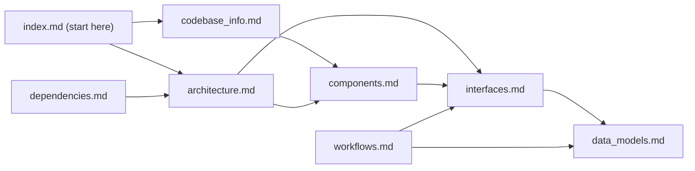

# Documentation Index

<!-- tags: index, navigation, ai-assistant-guide -->

> **For AI assistants:** Start here. This file tells you which document to read for each type of question. The summaries below are sufficient to determine relevance without reading the full file.

## How to Use This Documentation

1. **Navigating the codebase?** → `codebase_info.md` for layout, then `architecture.md` for design pattern.
2. **Understanding a component?** → `components.md` maps each module to its responsibility.
3. **Working on an API or IPC command?** → `interfaces.md` covers Tauri commands, CLI commands, and the Rust public API.
4. **Tracing a data structure?** → `data_models.md` covers all major types and their JSON shapes.
5. **Understanding a workflow end-to-end?** → `workflows.md` traces install, update-detection, and marketplace-add flows.
6. **Adding or auditing a dependency?** → `dependencies.md` lists all external crates and npm packages with purpose.
7. **Quick orientation for any task?** → `AGENTS.md` in the repo root is the single-file summary.

## Document Summaries

| File | Tags | Summary |
|---|---|---|
| `codebase_info.md` | overview, metadata | Project identity, workspace layout, crate table, tech stack, key constants. |
| `architecture.md` | architecture, patterns | Shared-core/thin-frontend pattern, service layer, IPC binding generation, file-based state, RAII guards, feature flags, security model. |
| `components.md` | components, modules | Per-module responsibility table for all Rust modules, Svelte components, stores, and xtask. |
| `interfaces.md` | api, ipc, cli | All Tauri IPC commands with parameter shapes, all CLI subcommands, `MarketplaceService` public Rust API, `GitBackend` trait, error wire format. |
| `data_models.md` | types, models, json | Core Rust types with fields and JSON wire shapes: tracking metadata, marketplace types, validation newtypes, error hierarchy. |
| `workflows.md` | workflows, processes | Step-by-step traces of: marketplace add, plugin install, update detection, skill browse, agent conversion. Mermaid sequence diagrams. |
| `dependencies.md` | dependencies, external | All workspace Rust dependencies and npm packages with version, purpose, and non-obvious usage notes. |
| `review_notes.md` | review, gaps | Consistency and completeness findings from the documentation review pass. |

## Relationships Between Documents

## Quick-Reference

| Question | File |
|---|---|
| Where does X live in the repo? | `codebase_info.md` |
| Why is the code structured this way? | `architecture.md` |
| What does `service.rs` / `cache.rs` / `project.rs` do? | `components.md` |
| What Tauri commands exist and what do they accept? | `interfaces.md` |
| What does `InstalledAgentMeta` look like on disk? | `data_models.md` |
| How does `kiro-market install` work end-to-end? | `workflows.md` |
| What does the `curl` dep actually do? | `dependencies.md` |
| What CI jobs must pass before merge? | `architecture.md` or `AGENTS.md` |
