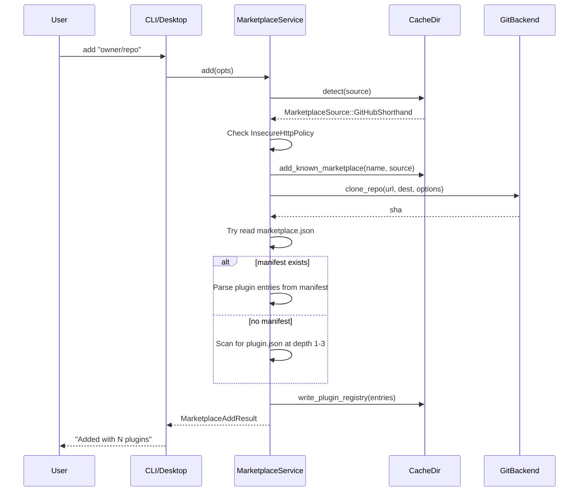
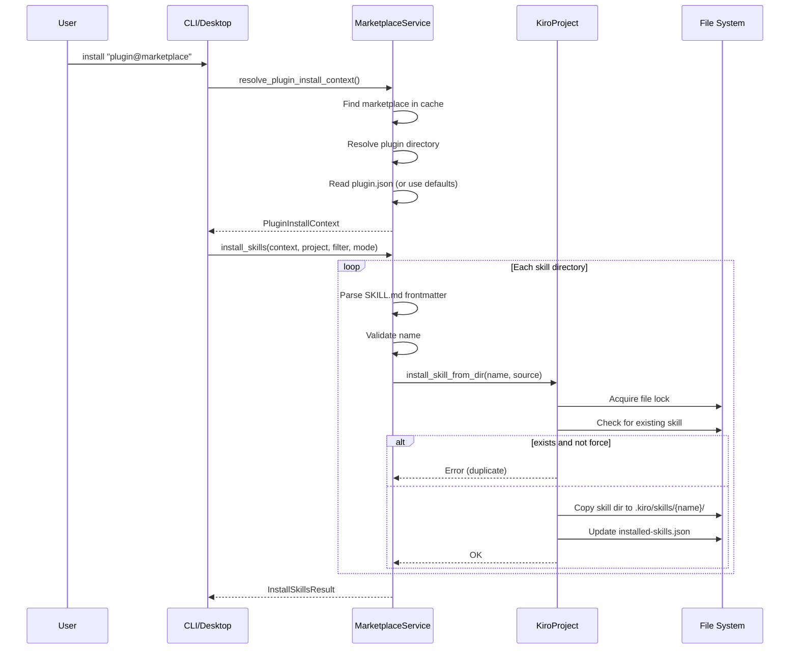
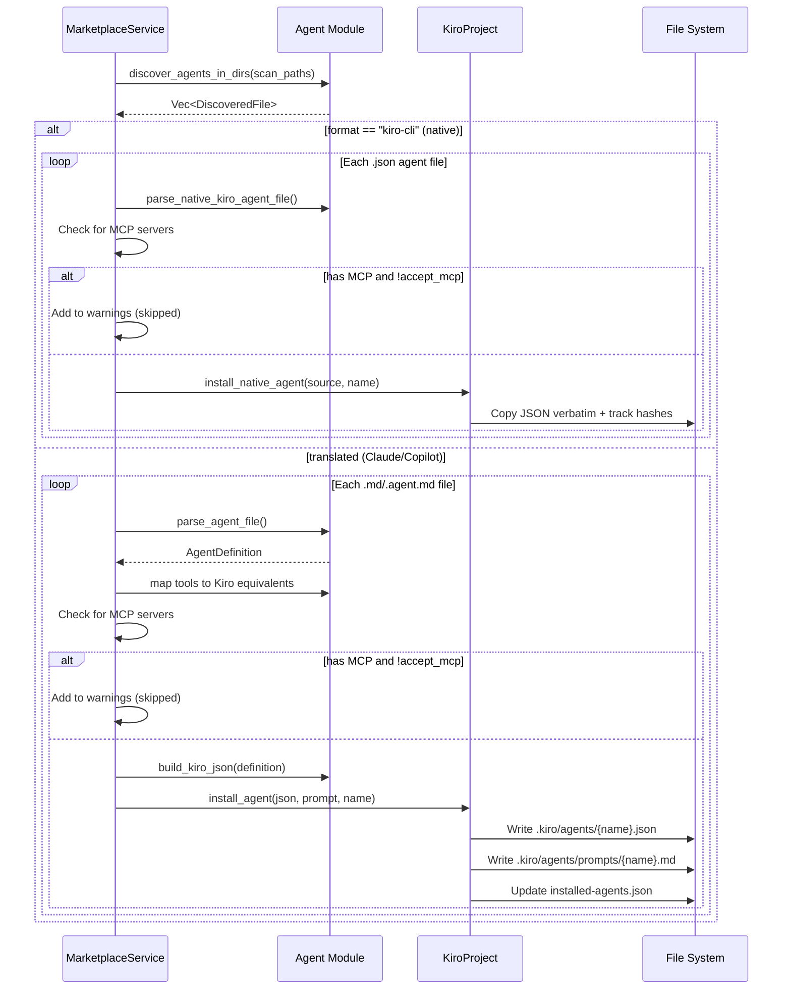
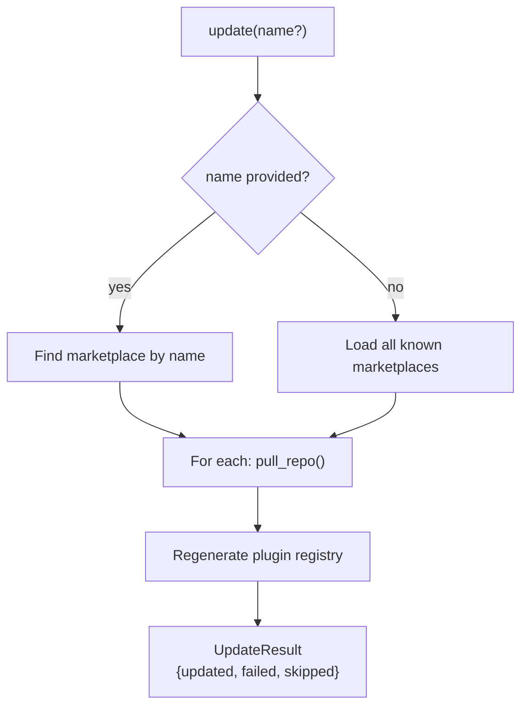
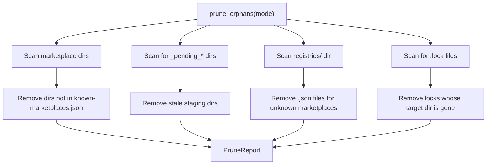
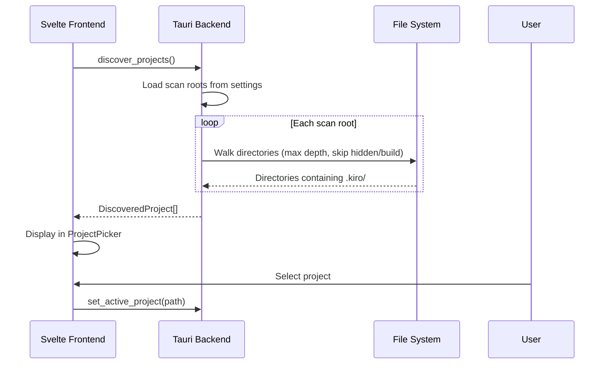
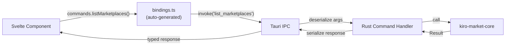

# Workflows

## Add Marketplace

**Key behaviors:**
- Local paths use symlinks/junctions instead of cloning
- Duplicate marketplace names are rejected
- `http://` URLs rejected unless `InsecureHttpPolicy::Allow`
- Failed clones trigger `DirCleanupGuard` to remove partial state
- Plugin registry is persisted for fast subsequent lookups

---

## Install Skills

**Key behaviors:**
- Skills are copied (not linked) to `.kiro/skills/{name}/SKILL.md`
- Multi-file skills with companion `.md` references are merged into single file
- File lock serializes concurrent installs of the same skill name
- `--force` overwrites existing; removes stale files from prior version
- Source and installed content hashes (BLAKE3) tracked for change detection

---

## Install Agents

**Key behaviors:**
- MCP-bearing agents require explicit `--accept-mcp` opt-in
- Native agents (format: "kiro-cli") are copied verbatim
- Translated agents produce JSON config + prompt markdown
- Tool names are mapped between dialects (unmapped tools generate warnings)
- Companion files (native) are tracked separately for cross-plugin collision detection
- RAII rollback removes partial writes if tracking update fails

---

## Update Marketplace

**Key behaviors:**
- Local (linked) marketplaces are skipped (no remote to pull from)
- Pull failures are recorded but don't abort other updates
- Plugin registry is regenerated after successful pull

---

## Cache Prune

---

## Project Discovery (Desktop App)

---

## Typed IPC Flow (Desktop)

