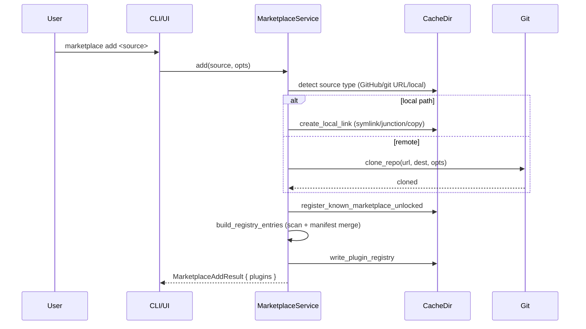
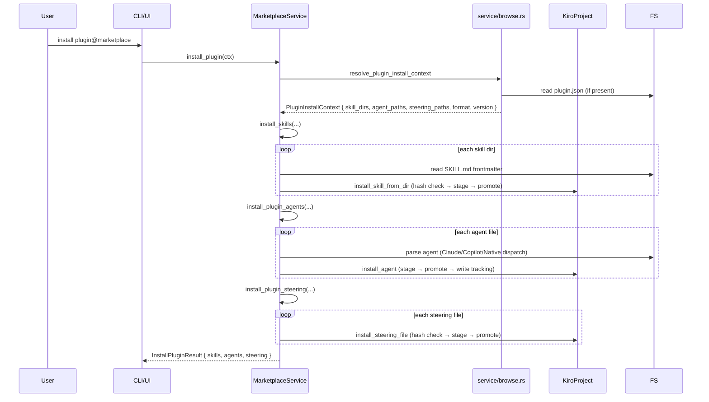
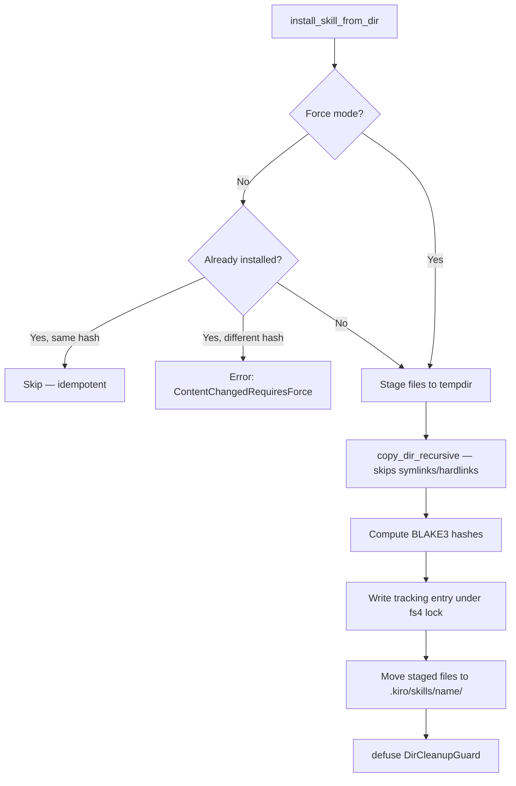
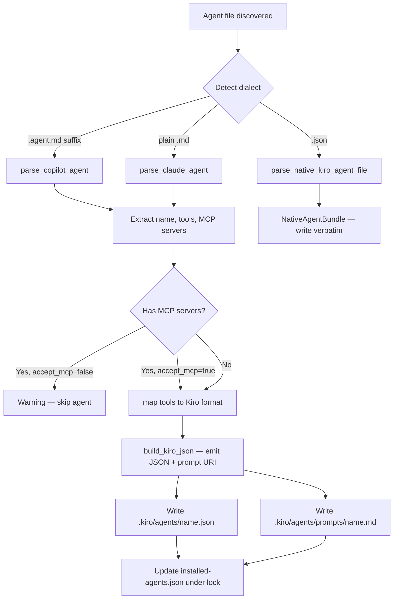
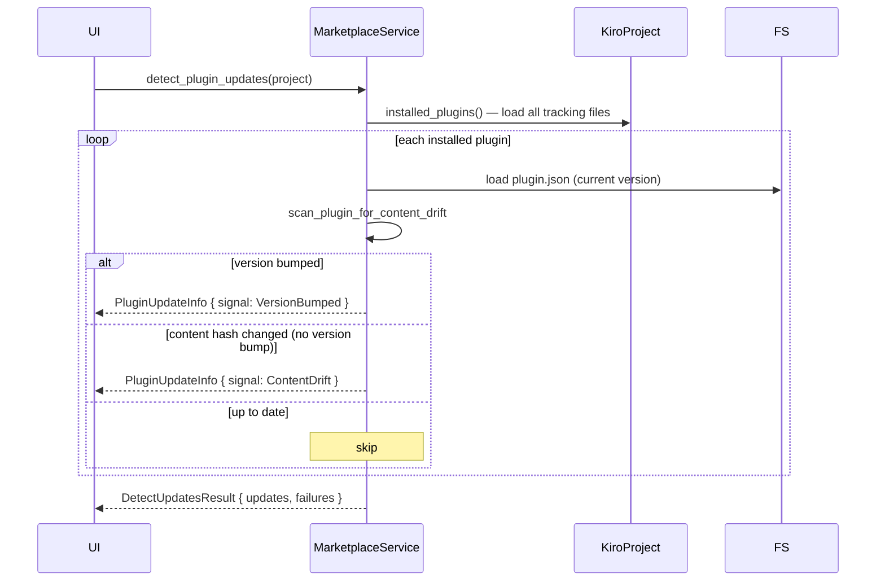
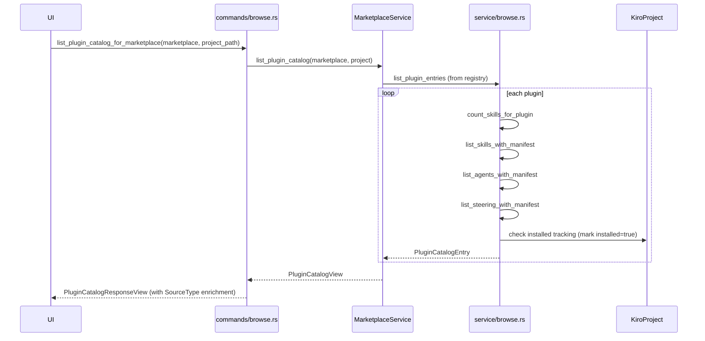
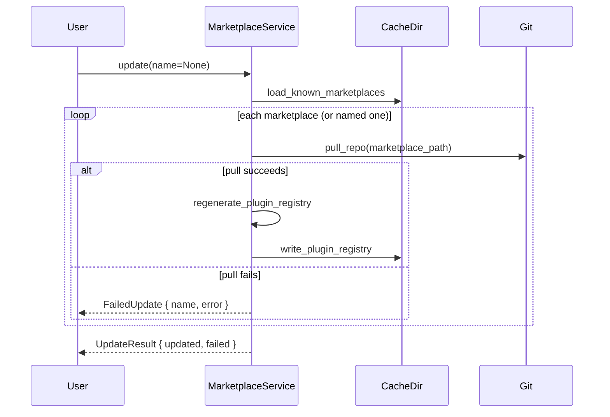
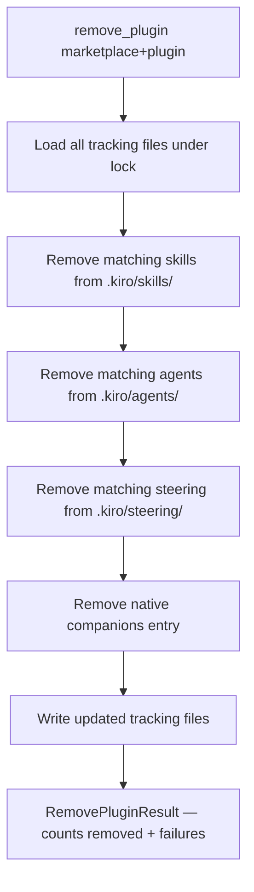

# Workflows

<!-- tags: workflows, processes, sequences -->

## 1. Add Marketplace

**Key details:**
- Source detection in `cache.rs::detect()` — handles GitHub shorthand (`owner/repo`), HTTPS/SSH URLs, local paths, file URLs
- `http://` rejected unless `allow_insecure_http: true`
- Duplicate marketplace names return an error
- Plugin registry is written atomically

---

## 2. Plugin Install (Full)

**Key details:**
- `InstallMode::Force` overwrites existing; default mode rejects duplicates
- BLAKE3 hashes compared: if source hash matches installed hash, install is skipped (idempotent)
- MCP agents blocked unless `accept_mcp: true`
- `DirCleanupGuard` ensures staging dirs are removed on failure
- Tracking files updated atomically under `fs4` lock

---

## 3. Skill Install (Detail)

---

## 4. Agent Conversion (Translated Format)

**Tool mapping:**
- Claude tools → `allowedTools` (Kiro native tool names)
- Copilot MCP refs → `tools` (MCP server references)
- Copilot bare names → dropped with `UnmappedReason`
- Deduplication applied (e.g., `Edit` + `Write` → `Write` only)

---

## 5. Update Detection

**Key details:**
- Version comparison: string equality (not semver)
- Content drift: re-hashes source files and compares to stored `source_hash`
- Structured sources (git subdir, git URL) return a failure (cannot check locally)
- Partial load warnings (corrupt tracking entries) are surfaced alongside results

---

## 6. Browse / Plugin Catalog

**Key details:**
- `SkippedItem` captures plugins/skills that could not be enumerated (with reason)
- `SkillCount` can be `Known(n)`, `Remote` (structured source), or `ManifestFailed`
- Installed flags are set by cross-referencing tracking files

---

## 7. Marketplace Update

---

## 8. Remove Plugin

Partial failures are collected (not fatal): files that fail to unlink are recorded in `failures` but the rest of the removal proceeds.
