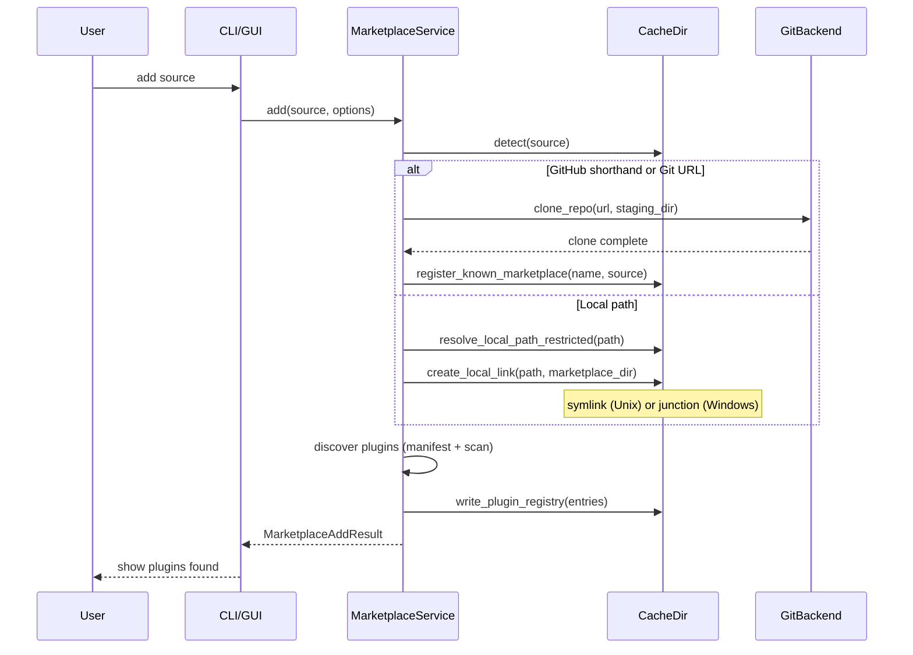
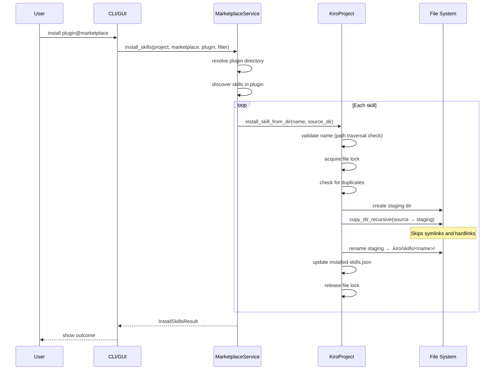
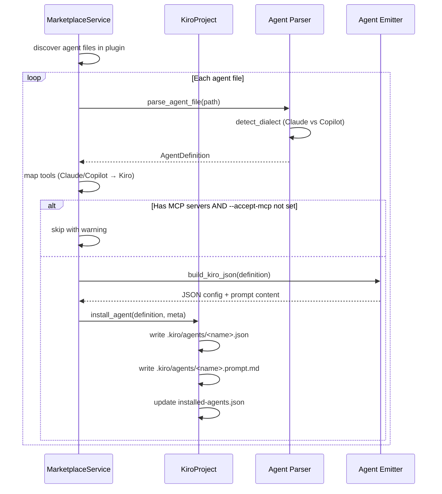
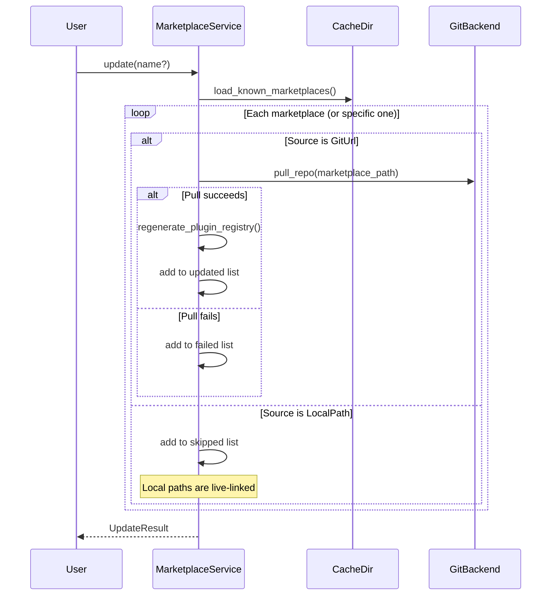
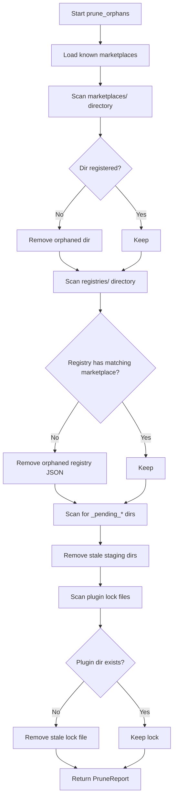
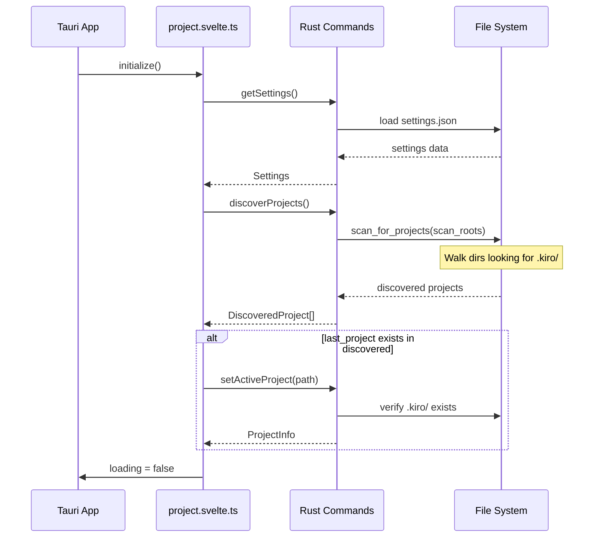
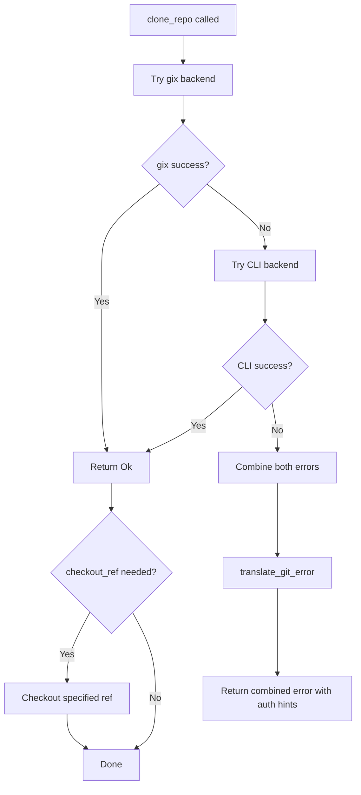
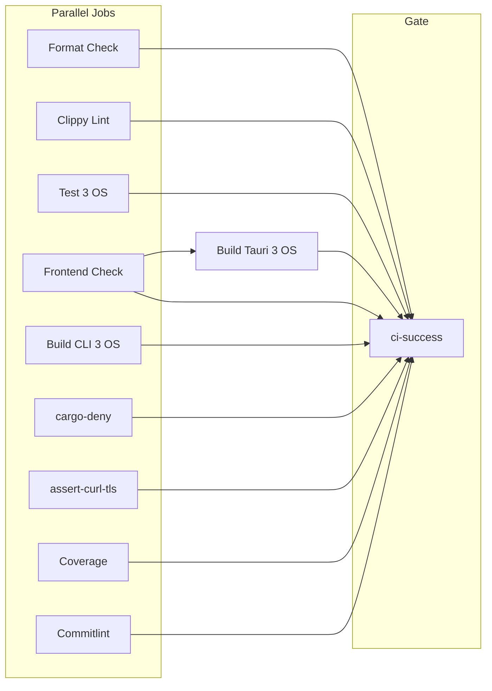
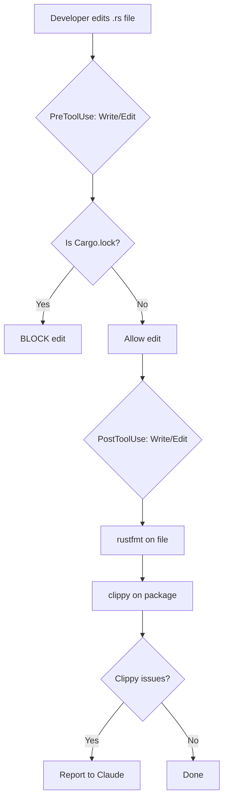

# Workflows

## Marketplace Registration

## Skill Installation

## Agent Installation

## Marketplace Update

## Cache Pruning

## Desktop App Initialization

## Git Clone (Dual Backend)

## CI Pipeline

## Development Workflow (Claude Hooks)

